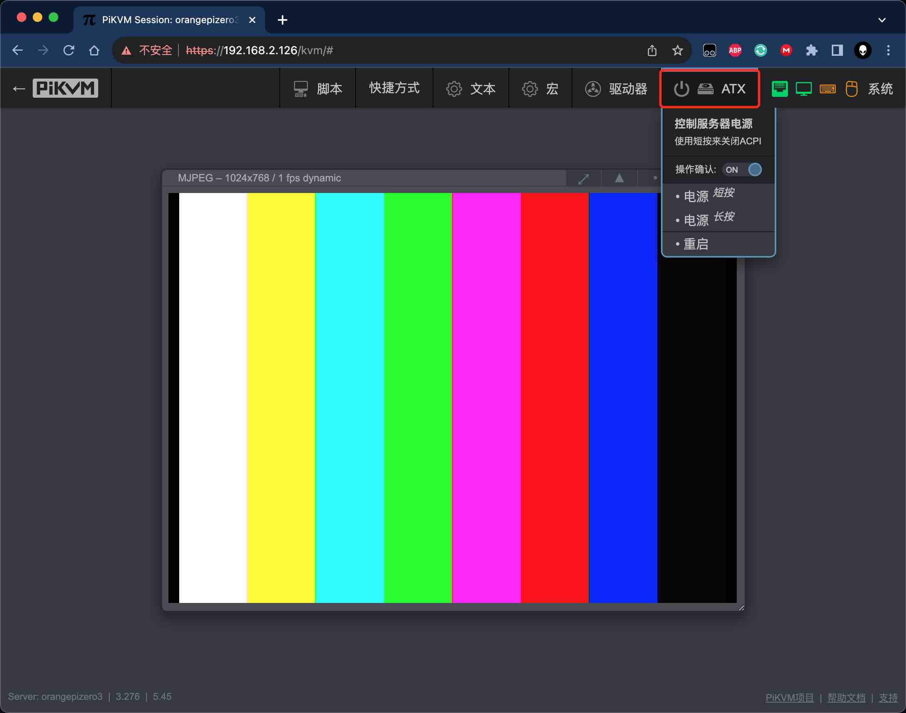

# ATX电源控制

ATX电源控制可以控制远程主机的开/关机，重启，且可以显示硬盘活动指示灯

!!! info "1ATX与4ATX版本的电源控制操作有细微差别"

-----

## 1ATX-HAT版本

- 进入KVM后，点击`ATX`按钮，可以看到三个选项，这三个选项分别模拟了***短按开机键***、***长按开机键***、***重启键***。

    { .off-glb }

- 当 {:width="20px" .off-glb} 图标为灰色时表示远程主机处于关机状态。

- 当 {:width="20px" .off-glb} 图标为绿色时表示主机处于开机状态或者正在开机中。

- 当 {:width="20px" .off-glb} 图标为灰色时，表示硬盘处于idle状态

- 当 {:width="20px" .off-glb} 图标为红色时，表示硬盘处于busy状态

-----

## 4ATX-HAT版本

- 4ATX的ATX电源控制按钮在`KVM切换 & 脚本`选项卡内，比1ATX版本多出`KVM切换器`端口按钮，用来控制[4口KVM切换器](material.md/#_2)对HDMI端口进行切换。

    { .off-glb }

- 当 {:width="20px" .off-glb} 为红色时，表示KVM切换器的HDMI信号在此端口上

- 当 {:width="20px" .off-glb} 图标为灰色时表示远程主机处于关机状态。

- 当 {:width="20px" .off-glb} 图标为绿色时表示主机处于开机状态或者正在开机中。

- 当 {:width="20px" .off-glb} 图标为灰色时，表示硬盘处于idle状态

- 当 {:width="20px" .off-glb} 图标为红色时，表示硬盘处于busy状态

    !!! info "4ATX版本的电源控制可以同时对4台主机进行开机、关机、重启操作"