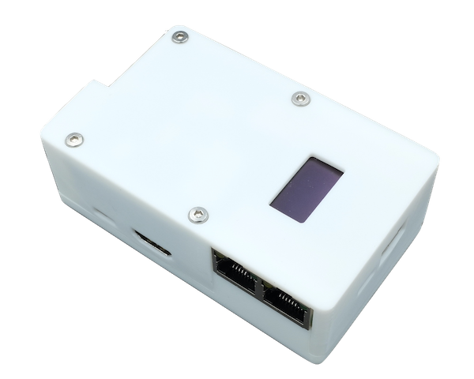

# 简介

-----
## OrangePi Zero3 PiKVM-HAT硬件

该项目基于开源系统[PiKVM](https://github.com/pikvm/pikvm)对Orangepi Zero3开发板进行扩展，为OrangePi Zero3扩展了PiKVM系统所需的ATX电源控制、OLED状态显示、USB、KVM切换控制等扩展接口。

目前HAT有两种版本，分别为4口ATX电源控制版本和1口ATX电源控制版本，其中：

* 4 ATX HAT包含功能：ATX*4、HDMI-IN、OLED、KVM切换控制、USB2.0，配合KVM切换器可以连接4台主机
* 1 ATX HAT包含功能：ATX*1、HDMI-IN、OLED、USB2.0，可以连接1台主机

    | 4ATX | 1ATX |
    |-----------|------------|
    | {:width="400px" .off-glb} | {:width="400px" .off-glb} |

-----
## 关于PIKVM系统

PIKVM是一个基于树莓派硬件的开源KVM over IP系统，意在打造一个相对不那么昂贵的IP-KVM设备，通过该系统可以轻松的对主机进行维护管理。

>*"This device helps to manage servers or workstations remotely, regardless of the health of the operating system or whether one is installed. You can fix any problem, configure the BIOS, and even reinstall the OS using the virtual CD-ROM or Flash Drive."* ---
>*[PIKVM主页](https://pikvm.org/) & [PiKVM GitHub](https://github.com/pikvm/pikvm)*
>
>*该设备有助于远程管理服务器或工作站，无论操作系统的运行状况如何或是否安装了操作系统。您可以修复任何问题，配置 BIOS，甚至使用虚拟 CD-ROM 或闪存驱动器重新安装操作系统。*
