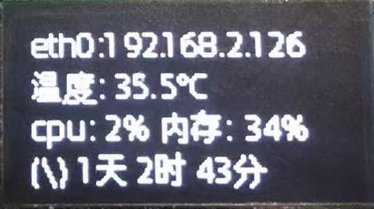
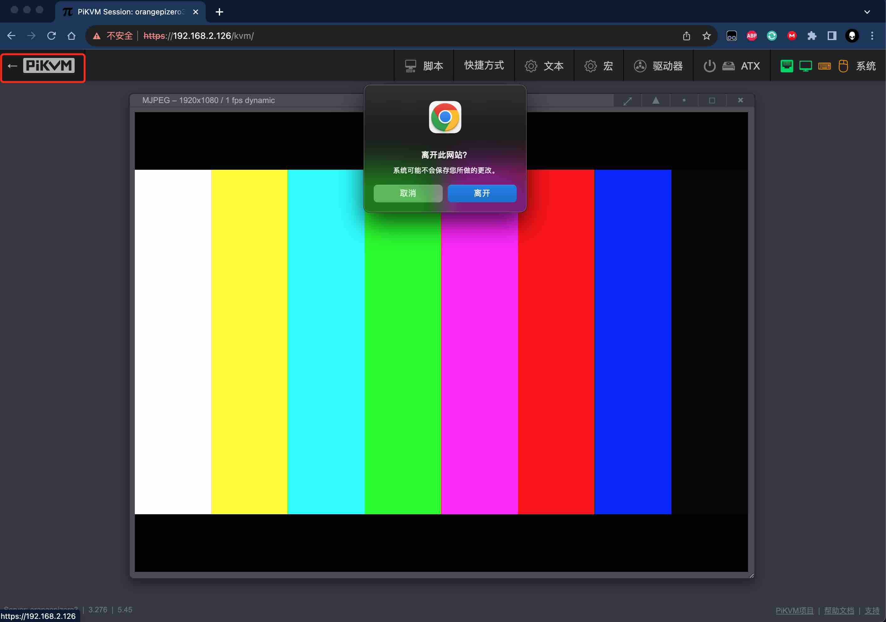

# 登录方式

!!! tips

    * Web UI登录用于访问远程主机
    * SSH用于登录PiKVM本机系统

-----
## Web UI登录

- 打开浏览器输入PiKVM的ip地址，ip地址会在oled屏幕上显示,输入[`PiKVM Web`](auth.md)用户名密码，如果开启了[2FA](auth.md#2fatwo-factor-authentication)功能，也请输入2FA code

    {:width="150px" .off-glb}

    {.off-glb}

- 登录成功后会跳转至网页控制台，分别为`KVM`、`Terminal终端`、`登出`按钮

    {.off-glb}

-----
## KVM

- 点击`KVM`按钮进入KVM功能界面，可以看到采集到远程主机的HDMI输出画面

    {.off-glb}

- 点击左上角PiKVM图标，提示离开此网站，点击离开，返回主控制台

    {.off-glb}

-----
## Web Terminal终端

有以下两种方式打开Web终端

1. 控制台点击`Terminal终端`按钮，进入Web Terminal终端

    {.off-glb}

2. `KVM`界面下点击`系统` > `终端`

    {.off-glb}

    Web Terminnal会以[`kvmd-webterm`](auth.md)账户默认登录，使用浏览器后退按钮返回控制台

    !!! example "也可以使用SSH终端软件通过root账号进行登录"
        ```console
        ssh root@PiKVM地址
        ```