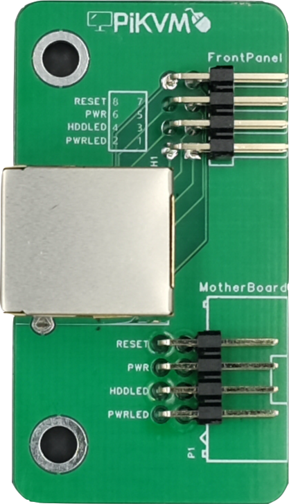

# 物品清单

!!! warning "不包含OrangePi zero3主板，该主板请自行购买"

-----

## OrangePi Zero3 PIKVM-HAT包含了哪些配件

 目前HAT有两种版本，分别为4口ATX电源控制版本和1口ATX电源控制版本，两种版本都不包含Orangepi zero3核心板；

| 4ATX版本 || 1ATX版本 ||
|---|---|---|---|
| 4ATX-HAT扩展板*1 | {:width="400px" .off-glb} | 1ATX扩展板*1 | {:width="400px" .off-glb} |
| FPC转type-C连接器*1 | {:width="50px" .off-glb} | FPC转type-C连接器*1 | {:width="50px" .off-glb} |
| ATX控制模块*1 | {:width="60px" .off-glb} | ATX控制模块*1 | {:width="60px" .off-glb} |

-----

## 需要自己准备的配件

- Orangepi Zero3主板*1
- 16G及以上容量的Class10 TF卡*1
- 5V3A电源适配器*1
- Type-A口转Typc-C口USB线*1

- HDMI连接线*1
- 千兆网线*2

    !!! tips "***可选配件*** "
        - 4端口KVM切换器

            *针对4ATX版本，可以选配4口KVM切换器同时接入4台主机实时切换4台设备的输出*

            {:width="200px" .off-glb}

        - 3D打印外壳

            文件下载地址

            百度网盘链接：链接：https://pan.baidu.com/s/1gMFjYP-u6TSE1NCVVAt3Cg?pwd=m6f3
            提取码：m6f3

            {:width="300px" .off-glb}

            {:width="300px" .off-glb}
