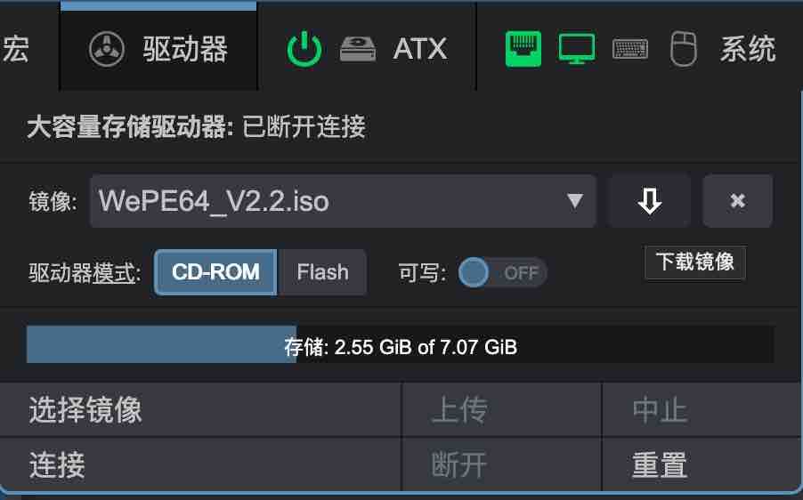
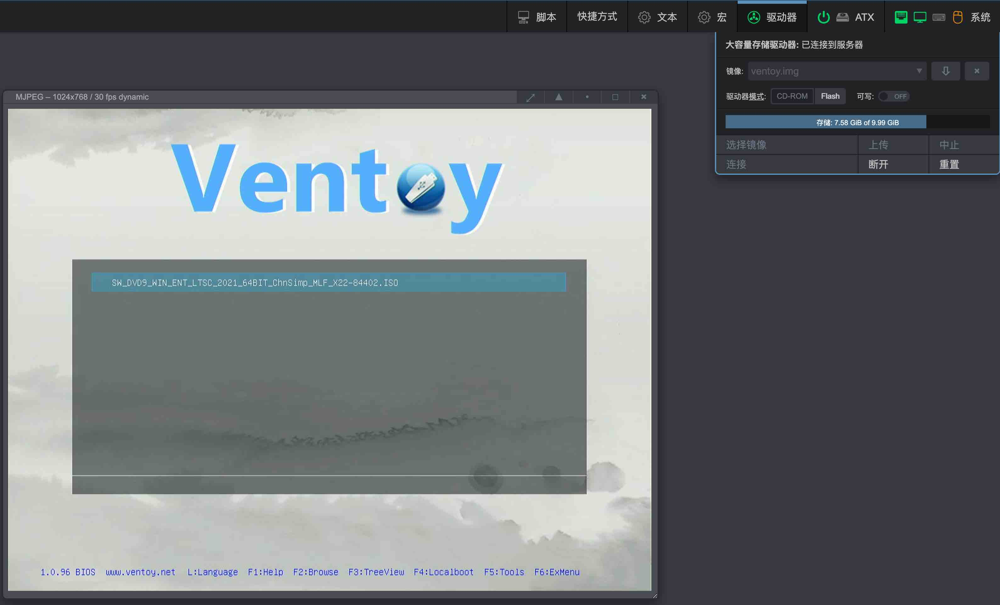

# MSD

MSD(Mass Storage Drive)大容量存储驱动器，当您需要使用镜像来恢复/安装操作系统时，PiKVM可以模拟成远程主机的虚拟CD-ROM或闪存动器，使远程主机可以通过bios/uefi引导进入挂载的安装镜像中。

| 查看Web UI中的“驱动器”菜单 |
|----------------------------------------|
| {:width="400px" .off-glb} |

提供如下操作:

- 将镜像上传到PiKVM的内部存储。
- 选择要连接到目标主机的镜像。
- 更改介质类型和写入可用性模式。
- 从PiKVM存储下载镜像。
- 驱动器连接管理等。

!!! warning
    切勿在镜像上传过程中或以将镜像以可写模式连接到目标主机时，断开PiKVM电源。
    这可能会导致文件损坏

!!! info "CD-ROM 最大镜像大小为2.2GB"
    这是由于[Linux内核限制](https://github.com/pikvm/pikvm/issues/322)，
    导致PiKVM无法模拟DVD驱动器。
    若要使用更大的启动镜像，请使用Flash驱动器模拟。
    如果无法做到这一点(例如有的镜像不支持Flash驱动引导，比如Windows安装iso)，
    你可以试试[这个方法](#ventoy)。

!!! info "只有在重新连接设备时，才能在CD-ROM和Flash之间更改介质类型"
    可以使用Web UI中的`系统` -> [将主USB连接到服务器](system.md/#usb)开关来完成重新连接设备的操作。

    **驱动模式是在`连接`镜像时确定的，而不是通过单击`驱动器模式`**时确定的。

    简单来说，通过`驱动器模式`修改过模式后，需要点击`连接`使其更改生效，但是远程主机不会实时变化，你需要通过关开[将主USB连接到服务器](system.md/#usb)模拟USB拔插的操作来使远程主机端识别到驱动器类型的变化。

-----
## 上传镜像

- 点击`选择镜像` -> `选择文件`，选择镜像。

    {:width="400px" .off-glb}

- 点击上传,出现上传进度条，点击中止可以中断上传任务。

    {:width="400px" .off-glb}

-----
## 连接镜像

- `镜像`下拉框中选择镜像，点击`连接`，通过`ATX`打开远程主机电源，进入bios启动项页面，选择**PiKVM CD-ROM Driver**，回车开始引导

    {.off-glb}

- 远程主机开始引导镜像

    {.off-glb}

-----
## 管理镜像

- 点击`断开`，大容量存储驱动器状态成为已断开连接状态下，`镜像`下拉选中需要操作的镜像，点击下拉框右侧的下载、删除按钮对镜像进行相应操作。

    {:width="400px" .off-glb}


-----
## 虚拟U盘

!!! info
    默认情况下，PiKVM会创建一个虚拟驱动器，用于模拟大容量存储挂载启动镜像引导目标主机，但是，如有必要，您可以创建第二个虚拟驱动器，该驱动器可以用于虚拟U盘，存放一些常用的文件，这样在既拥有引导镜像的同时也能获得一个额外的U盘，这将非常有用。

!!! note
    虚拟U盘是以`.img`文件的形式存在的，并且你可以在`镜像`下拉框中发现它。

- 挂载U盘，点击`脚本` -> `挂载虚拟U盘`

    {.off-glb}

- 卸载U盘，点击`脚本` -> `卸载虚拟U盘`

    {.off-glb}

附加的驱动器可能会涉及兼容性的问题。假设同一USB上有多个驱动器，可能在极少数BIOS/UEFI下导致无法识别到对应的驱动器。出于严谨，此功能需要手动激活。

要添加第二个虚拟驱动器，请按照以下步骤操作：

??? example "添加额外的驱动器用于虚拟U盘"

    1. 切换至root权限，编辑 `/etc/kvmd/override.yaml` :

        ```yaml
        otg:
            devices:
                drives:
                    enabled: true  # Set it to true to enable
                    count: 1  # +1 drive, default value
                    default:  # Default configuration for the all extra drives
                        cdrom: false  # Default value (false for the generic flash drive)
                        rw: false # Read-only by default
        ```

        或者直接使用指令添加配置文件

        ```shell
        cat << EOF > /etc/kvmd/override.d/extraUSB.yaml
        otg:
            devices:
                drives:
                    enabled: true  # Set it to true to enable
                    count: 1  # +1 drive, default value
                    default:  # Default configuration for the all extra drives
                        cdrom: false  # Default value (false for the generic flash drive)
                        rw: false # Read-only by default
        EOF
        ```

    2. 重启PiKVM:

        ```console
        [root@orangepizero3:~#] reboot
        ```

-----
## 使用Ventoy引导镜像

- 创建[Ventoy](https://www.ventoy.net/cn/index.html)引导镜像，镜像大小根据您所需要的安装镜像大小决定，这里以win10安装镜像为例子创建一个容量为5G的空白Ventoy引导。

    ```shell
    su -
    kvmd-helper-otgmsd-remount rw
    dd if=/dev/zero of=/var/lib/kvmd/msd/ventoy.img bs=1M count=5000 status=progress
    ```

- 下载Ventoy工具，对引导镜像进行分区并格式化。

    ```shell
    cd ~
    wget https://github.com/ventoy/Ventoy/releases/download/v1.0.96/ventoy-1.0.96-linux.tar.gz
    tar zxvf ventoy-1.0.96-linux.tar.gz
    kvmd-helper-otgmsd-remount rw
    losetup -f /var/lib/kvmd/msd/ventoy.img
    sh ~/ventoy-1.0.96/Ventoy2Disk.sh -i "$(losetup -l | grep ventoy | awk '{print $1}')"
    y
    y
    mkdir -p /mnt/ventoy
    mount "$(losetup -l | grep ventoy | awk '{print $1}')p1" /mnt/ventoy
    ```

- 将需要的安装包镜像文件拷贝至Ventoy引导镜像目录中，此时Ventoy的镜像目录挂载至/mnt/ventoy。

    !!! warning
        拷贝镜像前，请使用`df -h`指令确认/mnt/ventoy目录已经挂载

        ```console
        root@orangepizero3:~# df -h
        Filesystem      Size  Used Avail Use% Mounted on
        tmpfs            99M  7.1M   92M   8% /run
        /dev/mmcblk0p1  4.3G  2.4G  2.0G  55% /
        tmpfs           491M  148K  491M   1% /dev/shm
        tmpfs           5.0M  4.0K  5.0M   1% /run/lock
        tmpfs           491M     0  491M   0% /tmp
        /dev/mmcblk0p2   10G  6.9G  2.7G  73% /var/lib/kvmd/msd
        /dev/zram1       47M  548K   43M   2% /var/log
        tmpfs            99M     0   99M   0% /run/user/0
        /dev/loop0p1    4.9G   96K  4.9G   1% /mnt/ventoy
        ```

    ```shell
    scp windows.iso /mnt/ventoy
    ```

    或者windows下使用Winscp工具，将iso上传至/mnt/ventoy

    {.off-glb}

    {.off-glb}


- 待上传完成后取消挂载，并删除losetup设备

    ```shell
    umount "$(losetup -l | grep ventoy | awk '{print $1}')p1"
    losetup -d "$(losetup -l | grep ventoy | awk '{print $1}')"
    ```

- 在`驱动器`使用Flash模式挂载`ventoy.img`镜像，bios选择从PiKVM启动引导进入ventoy，按`L`键选择语言，选中镜像后回车选择正常启动，则可以开始windows安装程序，等待3-5分钟，安装程序开始。

    {.off-glb}
    {.off-glb}
    {.off-glb}

    !!! tips
        更换ventoy内的安装镜像，不需要重建ventoy镜像，只需要替换ventoy内的安装镜像，方法如下：

        - 将ventoy.img挂载至/mnt/ventoy目录下
            ```shell
            su -
            kvmd-helper-otgmsd-remount rw
            mount -o loop,offset=1048576 /var/lib/kvmd/msd/ventoy.img /mnt/ventoy
            df -h
            ```
        - 使用scp或者winscp将需要的安装包镜像文件更新至/mnt/ventoy，提前`df -h`确认/mnt/ventoy已挂载
            ```shell
            df -h
            scp windows.iso /mnt/ventoy
            ```
        - 镜像传输完成后，取消ventoy.img挂载，完成更新镜像
            ```shell
            umount /mnt/ventoy
            ```